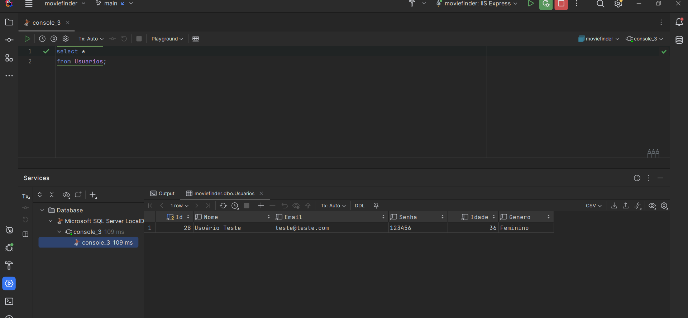

# Programação de Funcionalidades

Nesta seção são apresentadas as funcionalidades do sistema.

## Cadastro de Usuário (RF-07)

O modal de cadastro de usuário apresenta os campos a serem preenchidos. Os campos são: Nome, e-mail, senha, confirme sua senha, selecione o gênero e idade. Não será possível cadastrar mais de um usuário com o mesmo endereço de e-mail. Ao tentar cadastrar um usuário com um endereço de e-mail já existente, um alerta é exibido sinalizando que já há usuário cadastrado com o mesmo e-mail. Todos os campos possuem preenchimento obrigatório, caso algum deles não seja preenchido, seu estilo é alterado e se torna destacado em vermelho. Existem validações específicas, além da verificação de campo vazio, para os campos senha, confirmação de senha e endereço de e-mail. O campo senha permitirá no mínimo 5 caracteres e no máximo 8. O campo de confirmação de senha, consequentemente, também será submetido às mesmas validações além de ter seu conteúdo comparado com o conteúdo inserido no campo "senha". O campo e-mail será validado de acordo com o padrão exigido para um endereço de e-mail válido, como a existência do caracter "@" por exemplo. Ao concluir a ação, ou cancelá-la, fechando o modal, todos os campos são reiniciados.


Na imagem acima é possível observar os campos a serem preenchidos.


Na imagem acima é possível observar o destaque adquirido pelos campos não preenchidos pelo usuário, após a tentativa de cadastro.


Na imagem acima é possível observar a mensagem de sucesso após um cadastro bem sucedido.



Na imagem acima é possível observar os dados do usuário gravados no banco de dados.


Na imagem acima é possível observar a mensagem de erro na tentativa de cadastro de um usuário com um endereço de e-mail já existente no banco de dados.

### Requisitos atendidos

RF-07 - A aplicação deve permitir ao usuário cadastrar, ler, atualizar e excluir suas informações de cadastro.

### Artefatos da funcionalidade

- Home.jsx
- FilmeController.cs
- UsuarioService.cs

```C#
[HttpPost("cadastrarUsuario")]
    public async Task<IActionResult> CadastrarUsuario([FromBody] Usuario usuario)
    {
        var cadastrarUsuario = await _usuarioService.CadastrarUsuario(usuario);
        if (cadastrarUsuario)
        {
            return Ok("Usuario cadastrado com sucesso!");
        }

        return BadRequest("Já existe usuário cadastrado com esse endereço de e-mail!");
    }
```

```C#
public async Task<bool> CadastrarUsuario(Usuario usuario)
    {
        try
        {
            var usuarioDb = await _context.Usuarios.FirstOrDefaultAsync(u => u.Email == usuario.Email);
            if (usuarioDb != null)
            {
                return false;
            }
            _context.Add(usuario);
            await _context.SaveChangesAsync();
            return true;

        }
        catch (Exception e)
        {
            Console.WriteLine($"Ocorreu um erro: {e.Message}");
            throw;
        }
    }
```

```javascript
const [name, setName] = useState('');
  const [isNameValid, setIsNameValid] = useState(true);
  const [email, setEmail] = useState('');
  const [isEmailValid, setIsEmailValid] = useState(true);
  const [password, setPassword] = useState('');
  const [isPasswordValid, setIsPasswordValid] = useState(true);
  const [passwordConfirmation, setPasswordConfirmation] = useState('');
  const [isPasswordConfirmationValid, setIsPasswordConfirmationValid] = useState(true);
  const [age, setAge] = useState('');
  const [isAgeValid, setIsAgeValid] = useState(true);
  const [genre, setGenre] = useState('');
  const [isGenreValid, setIsGenreValid] = useState(true);
  const [open, setOpen] = React.useState(false);
  const [message, setMessage] = useState('');
  const [severity, setSeverity] = useState('');
  ```

```javascript
const showModalRegister = () => { setvisibleRegister(true);}
  const closeModalRegister = () => {
    setvisibleRegister(false);
    setIsNameValid(true);
    setName('');
    setIsEmailValid(true);
    setEmail('');
    setIsPasswordValid(true);
    setPassword('');
    setIsPasswordConfirmationValid(true);
    setPasswordConfirmation('');
    setIsGenreValid(true);
    setGenre('');
    setIsAgeValid(true);
    setAge('');
  }
```

```javascript
const handleSubmit = async () => {
    try {
      if ((isGenreValid && genre !== '') &&
          (isNameValid && name !== '') &&
          (validateEmail(email) && isEmailValid && email !== '') &&
          (isPasswordValid && password !== '' && 5 <= password.length <= 8) &&
          ((isPasswordConfirmationValid && passwordConfirmation !== '') &&
              (passwordConfirmation === password) && passwordConfirmation.length <= 8) &&
          ((isAgeValid && age !== '') && 12 <= age <= 100)) {
        const response = await api.post('/movieFinder/cadastrarUsuario', {
          nome: name,
          email,
          senha: password,
          idade: parseInt(age),
          genero: genre,
        })
        closeModalRegister()
        setSeverity("success");
        setMessage(response.data);
        setOpen(true)
        console.log(response.data);
      } else {
        if (genre === '') {
          setIsGenreValid(false);
        } else {
          setIsGenreValid(true);
        }
        if (name === '') {
          setIsNameValid(false);
        } else {
          setIsNameValid(true);
        }
        if (email === '' || !validateEmail(email)) {
          setIsEmailValid(false);
        } else {
          setIsEmailValid(true);
        }
        if (password === '' || password.length < 5 || password.length > 8) {
          setIsPasswordValid(false);
        } else {
          setIsPasswordValid(true);
        }
        if (passwordConfirmation === '' || passwordConfirmation.length > 8 || passwordConfirmation !== password) {
          setIsPasswordConfirmationValid(false);
        } else {
          setIsPasswordConfirmationValid(true);
        }
        if (age === '' || age < 12 || age > 100) {
          setIsAgeValid(false);
        } else {
          setIsAgeValid(true);
        }
      }

    } catch (error) {
      if (error.response && error.response.data) {
        setSeverity("error");
        setMessage(error.response.data);
        setOpen(true);
        console.error(error.response.data);
      } else {
        console.error(error);
      }
    }
  }
```

```javascript
function validateEmail(email) {
    const regex = /^[^\s@]+@[^\s@]+\.[^\s@]+$/;
    return regex.test(email);
  }
```

```javascript
const handleGenreChange = e => {
    const selectedGenre = e.target.value;
    if (selectedGenre === 'Masculino' || selectedGenre === 'Feminino') {
      setIsGenreValid(true);
      setGenre(selectedGenre);
    } else {
      setIsGenreValid(false);
      setGenre('');
    }
  };
```

```html
<div className="modal-register-home">
                  <h1>MovieFinder</h1>
                  <div className="modal-register-input-button">
                    <div className="modal-register-text">
                      <h2>Cadastro</h2>
                    </div>
                    <Input
                      color={isNameValid ? 'neutral' : 'danger'}
                      disabled={false}
                      size="md"
                      placeholder="Nome Completo..."
                      value={name}
                      onChange={e => setName(e.target.value )}
                    />
                    <Input
                      color={isEmailValid ? 'neutral' : 'danger'}
                      disabled={false}
                      size="md"
                      placeholder="E-mail..."
                      value={email}
                      onChange={e => setEmail(e.target.value )}
                    />
                    <Input
                      color={isPasswordValid ? 'neutral' : 'danger'}
                      disabled={false}
                      placeholder="Senha... (min 5, máx 8 caracteres)"
                      size="md"
                      value={password}
                      onChange={e => setPassword(e.target.value )}
                    />
                    <Input
                      color={isPasswordConfirmationValid ? 'neutral' : 'danger'}
                      disabled={false}
                      placeholder="Confirme sua senha..."
                      size="md"
                      value={passwordConfirmation}
                      onChange={e => setPasswordConfirmation(e.target.value)}
                    />

                    <select                   
                      value={genre}
                      className={`modal-register-select ${isGenreValid ? '' : 'invalid'}`}
                      onChange={handleGenreChange}
                    >
                      <option value="">
                        Selecione o gênero...
                      </option>
                      <option value="Masculino">Masculino</option>
                      <option value="Feminino">Feminino</option>
                    </select>
                    <Input
                      color={isAgeValid ? 'neutral' : 'danger'}
                      type="number"
                      disabled={false}
                      placeholder="Digite sua idade..."
                      size="md"
                      value={age}
                      onChange={e => setAge(e.target.value)}
                    />
                    <p>Crie sua conta agora no MovieFinder</p>
                    <Button
                     className="modal-register-button"
                     onClick={handleSubmit}
                    >
                      Cadastrar
                    </Button>
                  </div>
                </div>
```

```html
<Snackbar anchorOrigin={{ vertical: 'top', horizontal: 'center' }} open={open} autoHideDuration={3000} onClose={handleClose}>
                <Alert elevation={100000000} onClose={handleClose} severity={severity} sx={{ width: '100%' }}>
                  { message }
                </Alert>
              </Snackbar>
```

<span style="color:red">Pré-requisitos: <a href="2-Especificação do Projeto.md"> Especificação do Projeto</a></span>, <a href="3-Projeto de Interface.md"> Projeto de Interface</a>, <a href="4-Metodologia.md"> Metodologia</a>, <a href="3-Projeto de Interface.md"> Projeto de Interface</a>, <a href="5-Arquitetura da Solução.md"> Arquitetura da Solução</a>

Implementação do sistema descrita por meio dos requisitos funcionais e/ou não funcionais. Deve relacionar os requisitos atendidos com os artefatos criados (código fonte), deverão apresentadas as instruções para acesso e verificação da implementação que deve estar funcional no ambiente de hospedagem.

Por exemplo: a tabela a seguir deverá ser preenchida considerando os artefatos desenvolvidos.

|ID    | Descrição do Requisito  | Artefato(s) produzido(s) |
|------|-----------------------------------------|----|
|RF-001| Permitir que o usuário cadastre tarefas | tarefas.shtml / tarefas.cs / controllertarefas.cs | 
|RF-002| Emitir um relatório de tarefas no mês   | relatorio.shtml |

# Instruções de acesso

Não deixe de informar o link onde a aplicação estiver disponível para acesso (por exemplo: https://adota-pet.herokuapp.com/src/index.html).

Se houver usuário de teste, o login e a senha também deverão ser informados aqui (por exemplo: usuário - admin / senha - admin).

O link e o usuário/senha descritos acima são apenas exemplos de como tais informações deverão ser apresentadas.

> **Links Úteis**:
>
> - [Trabalhando com HTML5 Local Storage e JSON](https://www.devmedia.com.br/trabalhando-com-html5-local-storage-e-json/29045)
> - [JSON Tutorial](https://www.w3resource.com/JSON)
> - [JSON Data Set Sample](https://opensource.adobe.com/Spry/samples/data_region/JSONDataSetSample.html)
> - [JSON - Introduction (W3Schools)](https://www.w3schools.com/js/js_json_intro.asp)
> - [JSON Tutorial (TutorialsPoint)](https://www.tutorialspoint.com/json/index.htm)
